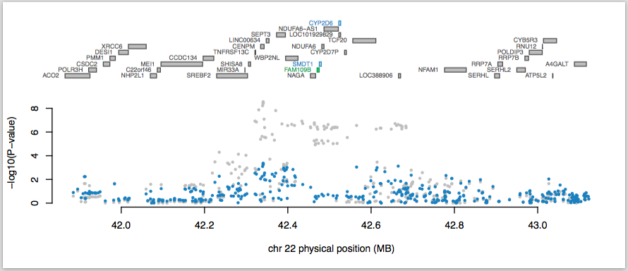

## Functional Summary-based Imputation

FUSION is a suite of tools for performing a transcriptome-wide (or any other ome-wide) association study by predicting functional/molecular phenotypes into GWAS using only summary statistics. **The goal is to identify associations between a GWAS phenotype and a functional phenotype that was only measured in reference data**. We provide precomputed functional weights (primarily gene expression) from multiple studies to facilitate this analysis. Please cite the following manuscript for primary TWAS methods:

| Gusev et al. "[Integrative approaches for large-scale transcriptome-wide association studies](https://www.ncbi.nlm.nih.gov/pubmed/26854917)"  2016 *Nature Genetics*

 As of 12/2016, the code and functional reference data have been extensively updated. Major changes include:

* A new framework that allows for multiple prediction models, independent reference LD, additional feature statistics, and cross-validation results. Tools are available to reproduce these weights and metrics within a single command.
* All reference weights have been recomputed for these new models, as well as evaluated by cross validation. Additional reference panels have been added. The most accurate model is automatically selected for each feature when performing a TWAS Test. Weights files are ~10x reduced in size.
* New analysis pipeline for conditional/joint tests of functional features and SNPs to identify driver genes and plot residual GWAS signal.

For questions or comments, contact Sasha Gusev [[agusev@hsph.harvard.edu](mailto:agusev@hsph.harvard.edu)].

## Outline

1. [Installation](#installation)
2. [Typical analysis and output](#typical-analysis-and-output)
3. [Download reference functional data](#reference-functional-data)
4. [Compute your own functional weights](#computing-your-own-functional-weights)
5. [Joint/conditional tests and plots](#jointconditional-tests-and-plots)
6. [Further analyses](#further-analyses)
7. [Command-line parameters](#command-line-parameters)
6. [FAQ](#faq)
7. [Change Log](#change-log)
8. [Acknowledgements](#acknowledgements)

---

## Installation

* Download and unpack the  [FUSION software package from github](https://github.com/gusevlab/fusion_twas):

~~~
wget https://github.com/gusevlab/fusion_twas/archive/master.zip
unzip master.zip
cd fusion_twas-master
~~~

* Download and unpack the (1000 Genomes)  [LD reference data](https://data.broadinstitute.org/alkesgroup/FUSION/LDREF.tar.bz2):

~~~
wget https://data.broadinstitute.org/alkesgroup/FUSION/LDREF.tar.bz2
tar xjvf LDREF.tar.bz2
~~~

* Download and unpack the [plink2R library](https://github.com/gabraham/plink2R) (by Gad Abraham):

~~~
wget https://github.com/gabraham/plink2R/archive/master.zip
unzip master.zip
~~~

* Launch R and install required libraries:

~~~
install.packages('optparse','RColorBrewer')
install.packages('plink2R-master/plink2R/',repos=NULL)
~~~

**if computing your own weights, the following additional steps are required**

* Add the bundled GCTA binary `gcta_nr_robust` to path (coded by Po-Ru Loh for robust non-linear optimization)
* Download and install [PLINK2](https://www.cog-genomics.org/plink2), add `plink` to path
* Launch R and install the following required libraries:

~~~
install.packages(c('glmnet','methods'))
~~~

* If using BSLMM, download and install [GEMMA](http://www.xzlab.org/software.html) software, add to path. Generate a symbolic link to the output by calling `ln -s ./ output` in the directory where you will run `FUSION.weights.R` (this is a workaround because GEMMA requires results to go into an `output` subdirectory).

## Typical analysis and output

The typical TWAS analysis takes pre-computed gene expression weights (below) together with disease GWAS summary statistics to estimate the association of each gene to disease. As an example, we will use the PGC Schizophrenia summary statistics to perform a TWAS with the GTEx whole-blood data. The example assumes you have setup FUSION and LD reference data as above and are in the FUSION directory with an LDREF subdirectory.

First, download and prepare the GWAS and GTEx whole blood data:

~~~
wget https://data.broadinstitute.org/alkesgroup/FUSION/SUM/PGC2.SCZ.sumstats

mkdir WEIGHTS
cd WEIGHTS
wget https://data.broadinstitute.org/alkesgroup/FUSION/WGT/GTEx.Whole_Blood.tar.bz2
tar xjf GTEx.Whole_Blood.tar.bz2
~~~

The WEIGHTS directory should contain a subdirectory of expression weights (which you can inspect in R), as well as several report files that describe the data (see below for details).  The following sections describe the inputs in detail.

### Input: GWAS summary statistics

The primary input is genome-wide summary statistics in [LD-score format](https://github.com/bulik/ldsc/wiki/Summary-Statistics-File-Format). At minimum, this is a flat file with a header row containing the following fields:

1. `SNP` -- SNP identifier (rsID)
2. `A1` -- first allele (effect allele)
3. `A2` -- second allele (other allele)
4. `Z` -- Z-scores, sign with respect to `A1`.

and subsequent data rows for each SNP (all white-space separated). Additional columns are allowed and will be ignored. We recommend using the [LDSC munge_stats.py](https://github.com/bulik/ldsc) utility for converting GWAS summary data into this format, which detects and reports many common pitfalls.

**Important:** the approach depends on having dense summary-level data with no significance thresholding (as is now commonly released with GWAS publications). We do not recommend running this out-of-the-box on data that has been pruned, thresholded, or restricted to top SNPs (consider single-marker tests for that).

### Input: Expression weights

The functional reference data are loaded using the `./WEIGHTS/GTEx.Whole_Blood.pos` which points to the individual `*.RDat` weight files, their gene identifiers, and physical positions. We have pre-computed `*.pos` files for all reference data downloadable below. Only weights in the file will be evaluated. The physical positions should correspond to the feature (e.g. TSS and TES) and will be used in the final output and for plotting.

### Performing the expression imputation

Finally, we run `FUSION.test.R` using this data on chromosome 22:

~~~
Rscript FUSION.assoc_test.R \
--sumstats PGC2.SCZ.sumstats \
--weights ./WEIGHTS/GTEx.Whole_Blood.pos \
--weights_dir ./WEIGHTS/ \
--ref_ld_chr ./LDREF/1000G.EUR. \
--chr 22 \
--out PGC2.SCZ.22.dat
~~~

This should take under a minute and you will see weight names and physical positions printed to screen. If everything worked, this will generate the file `PGC2.SCZ.22.dat` with 73 rows, one of which is the header. We examine this file in detail in the following section.

Under the hood, the analysis steps are: (1) unify the GWAS and reference SNPs and remove/flip alleles as appropriate; (2) impute GWAS Z-scores for any reference SNPs that were missing using the IMPG algorithm; (3) estimate the functional-GWAS association statistic; (4) report results over all features tested.

### Output: Gene-disease association

Let's look at the transcriptome-wide significant associations in `PGC2.SCZ.22.dat` (adjusted for 2058 genes in the GTEx whole blood reference) by calling `cat PGC2.SCZ.22.dat | awk 'NR == 1 || $NF < 0.05/2058'`. The first two lines are shown below, except I've transposed them to explain each entry:

| | Column | Value | Usage |
| --- |
| 1 | FILE | ... | Full path to the reference weight file used |
| 2 | ID | FAM109B | Feature/gene identifier, taken from `--weights` file |
| 3 | CHR | 22 | Chromosome |
| 4 | P0 | 42470255 | Gene start (from `--weights`) |
| 5 | P1 | 42475445 | Gene end (from `--weights`) |
| 6 | HSQ | 0.0447 | Heritability of the gene |
| 7 | BEST.GWAS.ID | rs1023500 | rsID of the most significant GWAS SNP in locus |
| 8 | BEST.GWAS.Z | -5.94 | Z-score of the most significant GWAS SNP in locus |
| 9 | EQTL.ID | rs5758566 | rsID of the best eQTL in the locus |
| 10 | EQTL.R2 |  0.058680 | cross-validation R2 of the best eQTL in the locus |
| 11 | EQTL.Z |  -5.16 | Z-score of the best eQTL in the locus | 
| 12 | EQTL.GWAS.Z | -5.0835 | GWAS Z-score for this eQTL |
| 13 | NSNP | 327 | Number of SNPs in the locus |
| 14 | MODEL | lasso | Best performing model |
| 15 | MODELCV.R2 |  0.058870 | cross-validation R2 of the best performing model |
| 16 | MODELCV.PV | 3.94e-06 | cross-validation P-value of the best performing model |
| 17 | TWAS.Z |  5.1100 | TWAS Z-score (our primary statistic of interest) |
| 18 | TWAS.P | 3.22e-07 | TWAS P-value |

*Interpreting the output:* This result indicates that the best performing prediction model for the gene was LASSO, which slightly outperformed the best eQTL (note a non-eQTL model is always used to compute the TWAS statistic even if the eQTL had higher accuracy). Over expression of the gene was positively associated with SCZ risk, which is consistent with the best eQTL SNP having a negative effect on expression and on GWAS. The TWAS Z-score was not more significant than the top GWAS SNP, which motivates conditional analyses to asses whether the locus harbors signal independent of the expression (see below).
 
## Reference functional data

The following tables list downloads for precomputed expression reference weights. Expression weights were typically computed from BLUP, BSLMM, LASSO, Elastic Net and top SNPs, except for instances where BLUP/BSLMM where excluded due to sample size or convergence issues. Each package contains a corresponding `*.profile` file listing performance statistics for each gene, as well as an `*.err` file summarizing performance and heritability across all genes.

#### Gene expression / splicing.

| Tissue | Assay | # Samples | # Features | Study |
| --- |
|  [Peripheral Blood](https://data.broadinstitute.org/alkesgroup/FUSION/WGT/NTR.BLOOD.RNAARR.tar.bz2) | RNA array | 1,247 | 2,454 | [1] NTR |
|  [Whole blood](https://data.broadinstitute.org/alkesgroup/FUSION/WGT/YFS.BLOOD.RNAARR.tar.bz2) | RNA array | 1,264 | 4,701 | [2] YFS |
|  [Adipose](https://data.broadinstitute.org/alkesgroup/FUSION/WGT/METSIM.ADIPOSE.RNASEQ.tar.bz2) | RNA-seq | &nbsp; 563 | 4,671 | [3] METSIM |
|  [Brain (DLPFC)](https://data.broadinstitute.org/alkesgroup/FUSION/WGT/CMC.BRAIN.RNASEQ.tar.bz2) | RNA-seq | &nbsp; 452 | 5,420 | [4] CMC |
|  [Brain (DLPFC)](https://data.broadinstitute.org/alkesgroup/FUSION/WGT/CMC.BRAIN.RNASEQ_SPLICING.tar.bz2) | RNA-seq splicing | &nbsp; 452 | 7,772 | [4] CMC |

#### GTEx gene expression (V6): RNA-seq across 44 post-mortal tissues.

| Tissue | # Samples | # Genes |
| --- |
|  [All tissues in one package (642MB)](https://data.broadinstitute.org/alkesgroup/FUSION/WGT/GTEx.ALL.tar) | - | 77894 |
|  [Adipose Subcutaneous](https://data.broadinstitute.org/alkesgroup/FUSION/WGT/GTEx.Adipose_Subcutaneous.tar.bz2) | 298 | 3579 |
|  [Adipose Visceral Omentum](https://data.broadinstitute.org/alkesgroup/FUSION/WGT/GTEx.Adipose_Visceral_Omentum.tar.bz2) | 185 | 2100 |
|  [Adrenal Gland](https://data.broadinstitute.org/alkesgroup/FUSION/WGT/GTEx.Adrenal_Gland.tar.bz2) | 126 | 1514 |
|  [Artery Aorta](https://data.broadinstitute.org/alkesgroup/FUSION/WGT/GTEx.Artery_Aorta.tar.bz2) | 197 | 3047 |
|  [Artery Coronary](https://data.broadinstitute.org/alkesgroup/FUSION/WGT/GTEx.Artery_Coronary.tar.bz2) | 118 | 1231 |
|  [Artery Tibial](https://data.broadinstitute.org/alkesgroup/FUSION/WGT/GTEx.Artery_Tibial.tar.bz2) | 285 | 3844 |
|  [Brain Caudate basal ganglia](https://data.broadinstitute.org/alkesgroup/FUSION/WGT/GTEx.Brain_Caudate_basal_ganglia.tar.bz2) | 100 | &nbsp;970 |
|  [Brain Cerebellar Hemisphere](https://data.broadinstitute.org/alkesgroup/FUSION/WGT/GTEx.Brain_Cerebellar_Hemisphere.tar.bz2) | &nbsp;89 | 1542 |
|  [Brain Cerebellum](https://data.broadinstitute.org/alkesgroup/FUSION/WGT/GTEx.Brain_Cerebellum.tar.bz2) | 103 | 2033 |
|  [Brain Cortex](https://data.broadinstitute.org/alkesgroup/FUSION/WGT/GTEx.Brain_Cortex.tar.bz2) | &nbsp;96 | 1069 |
|  [Brain Frontal Cortex BA9](https://data.broadinstitute.org/alkesgroup/FUSION/WGT/GTEx.Brain_Frontal_Cortex_BA9.tar.bz2) | &nbsp;92 | &nbsp;950 |
|  [Brain Hippocampus](https://data.broadinstitute.org/alkesgroup/FUSION/WGT/GTEx.Brain_Hippocampus.tar.bz2) | &nbsp;81 | &nbsp;558 |
|  [Brain Hypothalamus](https://data.broadinstitute.org/alkesgroup/FUSION/WGT/GTEx.Brain_Hypothalamus.tar.bz2) | &nbsp;81 | &nbsp;619 |
|  [Brain Nucleus accumbens basal ganglia](https://data.broadinstitute.org/alkesgroup/FUSION/WGT/GTEx.Brain_Nucleus_accumbens_basal_ganglia.tar.bz2) | &nbsp;93 | &nbsp;906 |
|  [Brain Putamen basal ganglia](https://data.broadinstitute.org/alkesgroup/FUSION/WGT/GTEx.Brain_Putamen_basal_ganglia.tar.bz2) | &nbsp;82 | &nbsp;647 |
|  [Breast Mammary Tissue](https://data.broadinstitute.org/alkesgroup/FUSION/WGT/GTEx.Breast_Mammary_Tissue.tar.bz2) | 183 | 2041 |
|  [Cells EBV-transformed lymphocytes](https://data.broadinstitute.org/alkesgroup/FUSION/WGT/GTEx.Cells_EBV-transformed_lymphocytes.tar.bz2) | 114 | 1464 |
|  [Cells Transformed fibroblasts](https://data.broadinstitute.org/alkesgroup/FUSION/WGT/GTEx.Cells_Transformed_fibroblasts.tar.bz2) | 272 | 4288 |
|  [Colon Sigmoid](https://data.broadinstitute.org/alkesgroup/FUSION/WGT/GTEx.Colon_Sigmoid.tar.bz2) | 124 | 1528 |
|  [Colon Transverse](https://data.broadinstitute.org/alkesgroup/FUSION/WGT/GTEx.Colon_Transverse.tar.bz2) | 169 | 2133 |
|  [Esophagus Gastroesophageal Junction](https://data.broadinstitute.org/alkesgroup/FUSION/WGT/GTEx.Esophagus_Gastroesophageal_Junction.tar.bz2) | 127 | 1500 |
|  [Esophagus Mucosa](https://data.broadinstitute.org/alkesgroup/FUSION/WGT/GTEx.Esophagus_Mucosa.tar.bz2) | 241 | 3391 |
|  [Esophagus Muscularis](https://data.broadinstitute.org/alkesgroup/FUSION/WGT/GTEx.Esophagus_Muscularis.tar.bz2) | 218 | 3316 |
|  [Heart Atrial Appendage](https://data.broadinstitute.org/alkesgroup/FUSION/WGT/GTEx.Heart_Atrial_Appendage.tar.bz2) | 159 | 1634 |
|  [Heart Left Ventricle](https://data.broadinstitute.org/alkesgroup/FUSION/WGT/GTEx.Heart_Left_Ventricle.tar.bz2) | 190 | 1581 |
|  [Liver](https://data.broadinstitute.org/alkesgroup/FUSION/WGT/GTEx.Liver.tar.bz2) | &nbsp;97 | &nbsp;756 |
|  [Lung](https://data.broadinstitute.org/alkesgroup/FUSION/WGT/GTEx.Lung.tar.bz2) | 278 | 2938 |
|  [Muscle Skeletal](https://data.broadinstitute.org/alkesgroup/FUSION/WGT/GTEx.Muscle_Skeletal.tar.bz2) | 361 | 2976 |
|  [Nerve Tibial](https://data.broadinstitute.org/alkesgroup/FUSION/WGT/GTEx.Nerve_Tibial.tar.bz2) | 256 | 4424 |
|  [Ovary](https://data.broadinstitute.org/alkesgroup/FUSION/WGT/GTEx.Ovary.tar.bz2) | &nbsp;85 | &nbsp;948 |
|  [Pancreas](https://data.broadinstitute.org/alkesgroup/FUSION/WGT/GTEx.Pancreas.tar.bz2) | 149 | 1691 |
|  [Pituitary](https://data.broadinstitute.org/alkesgroup/FUSION/WGT/GTEx.Pituitary.tar.bz2) | &nbsp;87 | 1165 |
|  [Prostate](https://data.broadinstitute.org/alkesgroup/FUSION/WGT/GTEx.Prostate.tar.bz2) | &nbsp;87 | &nbsp;880 |
|  [Skin Not Sun Exposed Suprapubic](https://data.broadinstitute.org/alkesgroup/FUSION/WGT/GTEx.Skin_Not_Sun_Exposed_Suprapubic.tar.bz2) | 196 | 2548 |
|  [Skin Sun Exposed Lower leg](https://data.broadinstitute.org/alkesgroup/FUSION/WGT/GTEx.Skin_Sun_Exposed_Lower_leg.tar.bz2) | 302 | 3729 |
|  [Small Intestine Terminal Ileum](https://data.broadinstitute.org/alkesgroup/FUSION/WGT/GTEx.Small_Intestine_Terminal_Ileum.tar.bz2) | &nbsp;77 | &nbsp;491 |
|  [Spleen](https://data.broadinstitute.org/alkesgroup/FUSION/WGT/GTEx.Spleen.tar.bz2) | &nbsp;89 | 1463 |
|  [Stomach](https://data.broadinstitute.org/alkesgroup/FUSION/WGT/GTEx.Stomach.tar.bz2) | 170 | 1507 |
|  [Testis](https://data.broadinstitute.org/alkesgroup/FUSION/WGT/GTEx.Testis.tar.bz2) | 157 | 3222 |
|  [Thyroid](https://data.broadinstitute.org/alkesgroup/FUSION/WGT/GTEx.Thyroid.tar.bz2) | 278 | 4082 |
|  [Uterus](https://data.broadinstitute.org/alkesgroup/FUSION/WGT/GTEx.Uterus.tar.bz2) | &nbsp;70 | &nbsp;608 |
|  [Vagina](https://data.broadinstitute.org/alkesgroup/FUSION/WGT/GTEx.Vagina.tar.bz2) | &nbsp;79 | &nbsp;675 |
|  [Whole Blood](https://data.broadinstitute.org/alkesgroup/FUSION/WGT/GTEx.Whole_Blood.tar.bz2) | 338 | 2058 |

## Computing your own functional weights

The script for computing expression weights yourself works **one gene at a time**, taking as input a standard binary [PLINK format](https://www.cog-genomics.org/plink2/formats#bed) file (bed/bim/fam) which contains only the desired SNPs in the cis-locus of the gene (or any other desired SNPs) and expression of the gene set as the phenotype. **We typically restrict the cis-locus to 500kb on either side of the gene boundary**.

A typical run looks like this:

~~~
Rscript FUSION.compute_weights.R \
--bfile $INP \
--tmp $TMP \
--out $OUT \
--models top1,blup,bslmm,lasso,enet
~~~

Assuming `$TMP`, `$INP`, and `$OUT` are defined, this will take as input the `$INP.bed/bim/fam` file and generate a `$OUT.RDat` file which contains the expression weights and performance statistics for this gene. Note that by default BSLMM is not enabled due to the intensive MCMC computation. We recommend running BSLMM on a sample of genes to evaluate performance and only retaining if accuracy is significantly higher than other models.

Under the hood, the detailed analysis steps are: (1) Estimate heritability of the feature and stop if not significant; (2) Perform cross-validation for each of the desired models; (3) Perform a final estimate of weights for each of the desired models and store results.

*Note:* Unless you plan to use your own LD-reference panel, we recommend first restricting your `--bfile` genotypes to the set of markers in the [LD reference data](https://data.broadinstitute.org/alkesgroup/FUSION/LDREF.tar.bz2) we provide, as this is the set of SNPs that will be used for the final association statistic.

*Optional:* After all genes have been evaluated, make a `WGTLIST` file which lists paths to each of the `*.RDat` files that were generated and call `Rscript FUSION.profile_wgt.R <WGTLIST>` to output a per-gene profile as well as an overall summary of the data and model performance. See the `*.profile` and `*.err` files bundled with any of the weights above for examples.

## Joint/conditional tests and plots

We often identify multiple associated features in a locus (or the same feature from multiple tissues) and would like to identify which are conditionally independent. Similarly, we may want to ask how much GWAS signal remains after the association of the functional is removed. The `FUSION.post_process.R` script performs post-processing on `FUSION.assoc_test.R` outputs to report these statistics. Continuing with the SCZ and GTEx whole blood example from above, let's extract the transcriptome-wide significant associations and analyze them:

~~~
cat PGC2.SCZ.22.dat | awk 'NR == 1 || $NF < 0.05/2058' > PGC2.SCZ.22.top

Rscript FUSION.post_process.R \
--sumstats PGC2.SCZ.sumstats \
--input PGC2.SCZ.22.top \
--out PGC2.SCZ.22.top.analysis \
--ref_ld_chr ./LDREF/1000G.EUR. \
--chr 22 \
--plot --locus_win 100000
~~~

This will read in the expression weights for the selected genes, consolidate them into overlapping loci (using the boundary defined by `--locus_win` ), and generate multiple conditional outputs along with the following summary figure:

The top panel shows all of the genes in the locus. The marginally TWAS associated genes are highlighted in blue, and those that are jointly significant (in this case, *FAM109B*) highlighted in green. The statistics for the jointly significant genes are reported in the file `PGC2.SCZ.TWAS.22.top.analysis.joint_included.dat` (which contains the joint estimates and p-values) and the statistics for those genes that were dropped due to being conditionally non-significant are in the corresponding `*.joint_dropped.dat` file (which contains the conditional estimates and p-values).

The bottom panel shows a Manhattan plot of the GWAS data before (gray) and after (blue) conditioning on the green genes. You can see that this locus goes from being genome-wide significant to non-significant after conditioning on the predicted expression of *FAM109B*. Detailed command-line parameters are described below. When working with many reference panels (such as GTEx), adding the `--legend joint` flag may be helpful to distinguish between panels.

## Further analyses

### Significance conditional on high GWAS effects (permutation test)

The imputed association statistic is well-calibrated under the null of no GWAS association, but may be inflated from by-chance QTL co-localization when the GWAS locus is highly significant and LD is extensive. To assess this, we have proposed a permutation test (`FUSION.assoc_test.R --perm <max runs>`) which shuffles the QTL weights and recomputes an empirical association statistic conditional on the GWAS effects at the locus. This effectively tests if the same distribution of QTL effect sizes could yield a significant association by chance. The test is implemented "adaptively", so permutation will stop after a sufficient number of significant observations (or at the maximum specified). This statistic is highly conservative (for example, truly causal genes can fail the test if their QTLs are in high LD with many other SNPs), and intended to prioritize associations that are already significant in the standard test for follow-up.

This adds the following columns to output: `PERM.PV`, the empirical permutation p-value (i.e. the fraction of permutations more significant than the observation); `PERM.N`, the total number of permutations performed, `PERM.ANL_PV` the analytical permutation p-value assuming permuted results are normally distributed, computing a Z-score to the observed results, and converting it to a two-tailed p-value.

### Testing for effect in multiple reference panels (omnibus test)

You may be interested in computing a p-value for the joint association of a single gene/feature using predictors from multiple reference panels. Because the GWAS samples are always the same, this cannot be estimated using a simple meta-analysis. We have implemented a multiple degree-of-freedom omnibus test (`FUSION.post_process.R --omnibus`) which estimates and adjusts for the pairwise correlation between functional features. In the case of N fully independent predictors this corresponds to an N-dof Chi^2 test. Because this is essentially a test for deviation of association statistics from the correlation matrix, care must be taken in evaluating biological plausibility by examining the pairwise correlations (also reported in a separate file).

### Computing LD-scores to estimate functional heritability (experimental)

You may be interested in estimating the fraction of trait heritability that could be explained by a given set of functional features (specifically, their genetic component). The `FUSION.post_process.R --ldsc` command will generate LD-score files for all given inputs (on the specified chromosome) in LDSC format, which can then be analyzed using [stratified LD-score Regression](https://github.com/bulik/ldsc) as a standard functional annotation. This will estimate the heritability explained by the given functional features, on their own or jointly with other annotations in the model.

## Command-line parameters

### `FUSION.compute_weights.R`

| Flag | Usage | Default |
| --- |
| \--bfile | Path to PLINK binary input file prefix (minus bed/bim/fam) | **required** |
| \--out | Path to output files | **required** |
| \--tmp | Path to temporary files | **required** |
| \--covar | Path to quantitative covariates (PLINK format) | optional |
| \--crossval | How many folds of cross-validation, 0 to skip | 5 |
| \--hsq_p | Minimum heritability p-value for which to compute weights. | 0.01 |
| \--hsq_set | Pre-computed heritability estimate (between 0.0-1.0), skips analysis. | optional |
| \--models | Comma-separated list of prediction models (see below) | blup,lasso,top1,enet |
| \--PATH_gcta | Path to `gcta` executable | gcta_nr_robust |
| \--PATH_gemma | Path to `gemma` executable | gemma |
| \--PATH_plink | Path to `plink` executable | plink |
| \--pheno | Path to functional phenotype file (e.g. expression; PLINK format) | optional |
| \--save_hsq | Save heritability results even if weights are not computed | OFF |
| \--verbose | How much chatter to print to screen: 0=nothing; 1=minimal; 2=all | 0 |

| | Gene expression models |
| --- |
| **blup** | Best Linear Unbiased Predictor computed from all SNPs. Requires GEMMA in path. |
| **bslmm** | Bayesian Sparse Linear Model (spike/slab MCMC). Requires GEMMA in path. |
| **enet** | Elastic-net regression (with mixing parameter of 0.5). |
| **lasso** | LASSO regression. Requires PLINK in path |
| **top1** | Single best eQTL. |

### `FUSION.assoc_test.R`

| Flag | Usage | Default |
| --- |
| \--chr | Chromosome to analyze | **required** |
| \--out | Path to output files | **required** |
| \--ref_ld_chr | Prefix to reference LD files in binary PLINK format by chromosome | **required** |
| \--sumstats | Path to LD-score format summary statistics (must have SNP, A1, A2, Z column headers) | **required** |
| \--weights | File listing functional weight RDat files | **required** |
| \--weights_dir | Path to directory where weight files | **required** |
| \--perm | Maximum number of permutations to perform for each feature, 0=off | 0 |
| \--perm_minp | If \--perm, threshold to initiate permutation test | 0.05 |

### `FUSION.post_process.R`

| Flag | Usage | Default |
| --- |
| \--chr | Chromosome to analyze | **required** |
| \--input | Path to TWAS test output  | **required** |
| \--out | Path to output files | **required** |
| \--ref_ld_chr | Prefix to reference LD files in binary PLINK format by chromosome | **required** |
| \--sumstats | Path to LDSC format summary statistics | **required** |
| \--ldsc | Compute LD-scores across all features. *This disables all other tests* | OFF |
| \--locus_win | How much to expand each feature (in bp) to define contiguous loci | 100,000 |
| \--minp_input | Minium p-value to include feature in the analysis  | 1.0 |
| \--minp_joint | Minium p-value to include feature in the joint model  | 0.05 |
| \--max_r2 | Features with r^2 greater than this will be considered identical (and pruned) | 0.9 |
| \--min_r2 | Features with r^2 less than this will be considered independent | 0.008 |
| \--omnibus | Perform omnibus test for features with multiple models (disables other tests) | optional |
| \--omnibus_corr | Only print pairwise correlations between models (model name or "best") | optional |
| \--plot | Generate pdf plots for each locus | OFF |
| \--plot_legend | Add a legend to the plot for reference panels [options=all/joint] | OFF |
| \--save_loci | Save conditioned GWAS results for each locus | OFF |

## FAQ

**What QC is performed internally on the GWAS summary data?**

The methods automatically match up SNPs by rsID, remove strand ambiguous markers (A/C or G/T) and flip alleles to match strand to the weights and reference LD data. **NO QC** is performed on the functional/expression phenotype or the genotypes. We recommend the standard steps described in the [GTEx documentation](http://gtexportal.org/home/documentationPage#staticTextAnalysisMethods). For GWAS data, the IMPG algorithm is also used to infer statistics for any reference SNPs that do not have GWAS scores.

**How careful do I have to be with samples/SNP matching across files?**

As long as your sample and SNP identifiers are consistent across all the files, they will be matched and the intersection will be taken for all analyses. Order does not matter. This means the intersection of individuals is taken across all input files (bfile/pheno/covar) for the weights analysis. Column order does not matter for any file that has a header row.

**Can I use my own LD reference panel?**

Yes! The functional reference data is completely decoupled from the expression weights. If you are computing your own weights or have richer/unique LD data, simply convert it into by-chromosome binary PLINK files and point to them using the `--ref_ld_chr` flag. Standard caveats apply: the LD-reference should maximally cover the reference weight SNPs; should match the reference and GWAS populations; and increases in accuracy with sample size.

**How can I validate the TWAS associations?**

We recommend the same procedures for confirming TWAS associations as have been used in GWAS analyses: replication in an external study. This can be done at the level of individual associations, or in aggregate using a gene-based risk score (see manuscript for details).

We also proposed a permutation test in the manuscript the evaluates how significant the contribution from expression data is *on top* of the GWAS signal. Loci that pass this permutation test show evidence of heterogeneity that's captured by the expression, and are less likely to be chance co-localization.

Lastly, the top eQTL in a gene is expected to explain a substantial fraction of the signal, so individual inspection of eQTLs and conditional analysis can help elucidate the underlying causal variant.

**How should I interpret the effect direction?**

The TWAS effect-size is an estimate of the genetic covariance between gene expression and the GWAS trait, so the direction of effect is informative of this relationship. If the phenotypes have not been treated unusually, then a positive effect means over-expression of the gene leads to an increase in the phenotype (and vice versa). 

**What if the GWAS statistics have highly variable sample sizes?**

In principle having different sample sizes will violate the assumptions made in the IMPG/TWAS approaches and may lead to spurious results. Conservatively, we would recommend to restrict analyses to SNPs that have similar sample sizes, though we have not observed substantial differences in practice. If you do see differences, email us and we can work towards more specific recommendations.

**What related software is available?**

TWAS has analogs to co-localization and Mendelian randomization (with gene expression as one of the traits). [COLOC](https://github.com/chr1swallace/coloc) from the Wallace lab performs Bayesian co-localization analyses. There are many approaches to Mendelian randomization, but [this code](https://github.com/sb452/mr-code) from Stephen Burgess is a great primer; as well as the [SMR/HEIDI](http://cnsgenomics.com/software/smr/) test from the Yang lab. The [MetaXcan](https://github.com/hakyimlab/MetaXcan) and [PrediXcan](https://github.com/hakyimlab/PrediXcan) suite of tools from the Im lab performs gene-based association tests with and without summary data.

You may also be interested in [HESS](http://bogdan.bioinformatics.ucla.edu/software/hess/) to estimate local heritability; [PAINTOR](http://bogdan.bioinformatics.ucla.edu/software/paintor/) to fine-map causal variants; [LD-score Regression](https://github.com/bulik/ldsc) to estimate genome-wide heritability and genetic correlation.

## Change Log

| 2017/01/04 | Added LD-score computation. METSIM weights were missing chr18. |
| 2016/12/01 | Formal FUSION release, complete codebase and reference overhaul. |

## Acknowledgements

We are grateful to the functional resources and all of the hard worked involved in study design, data acquisition, and analysis. Without the efforts of these groups our tools would be useless.

~~~
Data were generated as part of the CommonMind Consortium supported by funding from Takeda Pharmaceuticals Company Limited, F. Hoffman-La Roche Ltd and NIH grants R01MH085542, R01MH093725, P50MH066392, P50MH080405, R01MH097276, RO1-MH-075916, P50M096891, P50MH084053S1, R37MH057881 and R37MH057881S1, HHSN271201300031C, AG02219, AG05138 and MH06692. Brain tissue for the study was obtained from the following brain bank collections: the Mount Sinai NIH Brain and Tissue Repository, the University of Pennsylvania Alzheimer’s Disease Core Center, the University of Pittsburgh NeuroBioBank and Brain and Tissue Repositories and the NIMH Human Brain Collection Core. CMC Leadership: Pamela Sklar, Joseph Buxbaum (Icahn School of Medicine at Mount Sinai), Bernie Devlin, David Lewis (University of Pittsburgh), Raquel Gur, Chang-Gyu Hahn (University of Pennsylvania), Keisuke Hirai, Hiroyoshi Toyoshiba (Takeda Pharmaceuticals Company Limited), Enrico Domenici, Laurent Essioux (F. Hoffman-La Roche Ltd), Lara Mangravite, Mette Peters (Sage Bionetworks), Thomas Lehner, Barbara Lipska (NIMH).
~~~

~~~
The Genotype-Tissue Expression (GTEx) Project was supported by the Common Fund  of the Office of the Director of the National Institutes of Health. Additional funds were provided by the NCI, NHGRI, NHLBI, NIDA, NIMH, and NINDS. Donors were enrolled at Biospecimen Source Sites funded by NCI\SAIC-Frederick, Inc. (SAIC-F) subcontracts to the National Disease Research Interchange (10XS170), Roswell Park Cancer Institute (10XS171), and Science Care, Inc. (X10S172). The Laboratory, Data Analysis, and Coordinating Center (LDACC) was funded through a contract (HHSN268201000029C) to The Broad Institute, Inc. Biorepository operations were funded through an SAIC-F subcontract to Van Andel Institute (10ST1035). Additional data repository and project management were provided by SAIC-F (HHSN261200800001E). The Brain Bank was supported by a supplements to University of Miami grants DA006227 & DA033684 and to contract N01MH000028. Statistical Methods development grants were made to the University of Geneva (MH090941 & MH101814), the University of Chicago (MH090951, MH090937, MH101820, MH101825), the University of North Carolina - Chapel Hill (MH090936 & MH101819), Harvard University (MH090948), Stanford University (MH101782), Washington University St Louis (MH101810), and the University of Pennsylvania (MH101822).
~~~

~~~
The Netherlands Study of Depression and Anxiety (NESDA) and the Netherlands Twin Register (NTR) were funded by the Netherlands Organization for Scientific Research (MagW/ZonMW grants 904-61-090, 985-10-002,904-61-193,480-04-004, 400-05-717, 912-100-20; Spinozapremie 56-464-14192; Geestkracht program grant 10-000-1002); the Center for Medical Systems Biology (CMSB2; NWO Genomics), Biobanking and Biomolecular Resources Research Infrastructure (BBMRI-NL), VU University EMGO+ Institute for Health and Care Research and the Neuroscience Campus Amsterdam, NBIC/BioAssist/RK (2008.024); the European Science Foundation (EU/QLRT-2001-01254); the European Community’s Seventh Framework Program (FP7/2007-2013); ENGAGE (HEALTH-F4-2007-201413); and the European Research Council (ERC, 230374).
~~~

~~~
The Young Finns Study has been financially supported by the Academy of Finland: grants 286284 (T.L), 132704 (M.H.), 134309 (Eye), 126925, 121584, 124282, 129378 (Salve), 117787 (Gendi), and 41071 (Skidi); the Social Insurance Institution of Finland; Kuopio, Tampere and Turku University Hospital Medical Funds (grant X51001 for T.L.); Juho Vainio Foundation; Paavo Nurmi Foundation; Finnish Foundation of Cardiovascular Research (T.L.); Finnish Cultural Foundation; Tampere Tuberculosis Foundation (T.L., M.H.); Emil Aaltonen Foundation (T.L.); and Yrjö Jahnsson Foundation (T.L., M.H.)
~~~

~~~
The METSIM study has been supported by the Academy of Finland, the Finnish Diabetes Research Foundation, the Finnish Cardiovascular Research Foundation, the Strategic Research Funding from the University of Eastern Finland, Kuopio, Finland and EVO grant 5263 from the Kuopio University Hospital.
~~~

*Logo by [Ryan Beck](https://thenounproject.com/Ryaaaan/) from The Noun Project*
